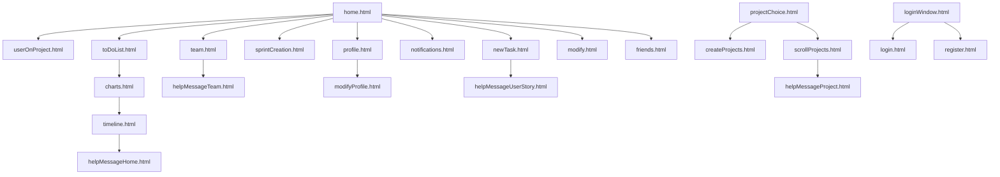

# Description of Project

Digi-Sm or Digital Scrum Master is a website designed to help you and your team develop projects and to learn
and apply the agile methodology. Its easy to use and can help your entire team get on board about what
user stories are left and the priority of these. You can create and input all your user stories at once
and then create your sprints as you go along. This is designed to help you stick to a schedule and visualise your project.

## How to launch the website directly from terminal once in folder

1.Download requierements by opening commandline in the project folder:

- pip install -r requirements.txt

Once the requirements are installed launch with:

2.1 This command to load mock data in the database. WARNING: This will delete existing database

- python run.py -dummy

2.2 This command to load the existing database

- python run.py

2.3 This command to create an empty database during first launch. WARNING: This will delete existing database

- python run.py -create

## To access admin features

Username : admin123

Password : admin123##!wqeq

## HTTP flask routes

1. 127.0.0.1:5000/ : home page where the brunt of the website is
2. 127.0.0.1:5000//load_sprint/<int:sprint_id> : used to load the sprint data
3. 127.0.0.1:5000/shift_sprint/ : used to load set of 5 sprints when shifting timeline
4. 127.0.0.1:5000/create_sprint/ : creates a new sprint
5. 127.0.0.1:5000/update_order : receives order of user story list from front-end to update back-end
6. 127.0.0.1:5000/createProject : used to create new projects
7. 127.0.0.1:5000/finishProject/<int:project_id> : allows to mark a project as finished
8. 127.0.0.1:5000/choose_project/<int:project_id> : loads the data of selected project
9. 127.0.0.1:5000/redirectProjects : leads to list of projects you're working on
10. 127.0.0.1:5000/profile : allows to access and modify user profile
11. 127.0.0.1:5000/userOnProject : used to load users working on project
12. 127.0.0.1:5000/addUserProjectByUsername : adds user to project by username in text field
13. 127.0.0.1:5000/addUserProjectButton : adds friends to project with a simple button click
14. 127.0.0.1:5000/friends : loads friends page
15. 127.0.0.1:5000/team : allows to access information about team, add users to project or add friend with a button
16. 127.0.0.1:5000/bloc_user/<int:user_id1> : admin feature to block user
17. 127.0.0.1:5000/change_group/<int:user_id1> : admin feature to promote or demote users to admin
18. 127.0.0.1:5000/admin : deprecated version of admin feature
19. 127.0.0.1:5000/notification : loads list of friend and project requests to be accepted or refused
20. 127.0.0.1:5000/newTask : creates new task
21. 127.0.0.1:5000/delete/<int:task_id> : deprecated version of delete which was removed as user stories shouldn't be deleted
22. 127.0.0.1:5000/check_uncheck/<int:task_id> : allows to change the status of user stories
23. 127.0.0.1:5000/modify/<int:task_id> : loads a screen to modify user stories
24. 127.0.0.1:5000/register : used to register new users
25. 127.0.0.1:5000/login : used to login user
26. 127.0.0.1:5000/logout : logs user out
27. 127.0.0.1:5000/helperMessage/<int:helpMessageId> : used to load tutorial messages

## HTML structure

