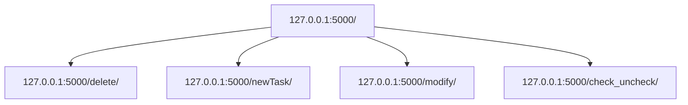

# Description du projet
Le projet consiste en une To-do list qui permet de créer, modifier, annuler des tâches. On peut également mettre des états aux différentes tâches : Fait ou Pas fait. Nous avons choisis un dictionnaire python comme structure de données pour gérer les différentes tâches. Il y a aussi une certaine gestions des inputs pour le nom des identifiants et des tâches.

## Détails des routes HTTP
1. 127.0.0.1:5000/ : application principale
2. 127.0.0.1:5000/delete/ : utilisé pour supprimer des tâches grâce au bouton delete. Prend l'identifiant de la clé à supprimer en paramètre
3. 127.0.0.1:5000/newTask/ : utilisé pour l'onglet servant à créer une nouvelle tâche
4. 127.0.0.1:5000/modify/ : permet la modification du nom d'une tâche grâce au bouton Modify. Prend en paramètre l'identifiant de la tâche à modifier
5. 127.0.0.1:5000/check_uncheck/ : permet de changer une tâche de l'état ToDo à Done. Prend également en paramètre l'identifiant de la tâche concernée

# Comment lancer le projet ? 
Il suffit de se mettre dans le répertoire principal, de créer un environnement virtuel (virtualenv ou conda) qui contient Flask, et de lancer le fichier run.py ($ python3 run.py)

